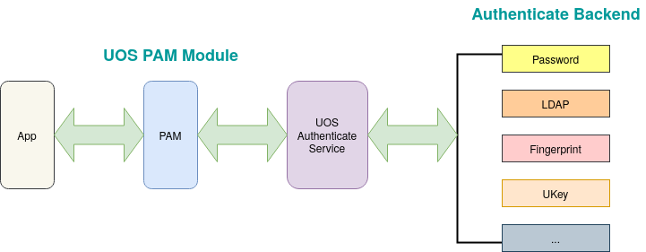

# % Options Settings: https://orgmode.org/manual/Export-Settings.html
#+OPTIONS: timestamp:nil ^:nil <:nil p:t prop:t tags:t tasks:t todo:t
#+LATEX_CLASS: article
#+LaTeX_CLASS_OPTIONS: [a4paper,12pt]
#+LATEX_HEADER: \usepackage{booktabs}
# % to include pdf/eps/png files
#+LATEX_HEADER: \usepackage{indentfirst}
#+LATEX_HEADER: \usepackage{graphicx}
# % useful to add 'todo' markers
#+LaTeX_HEADER: \usepackage{todonotes}
# % hyperrefs
#+LaTeX_HEADER: \usepackage{hyperref}
# % ----------------- Code blocks ----------------
# % Dependencies: pip install pygments
# % nice source code formatting
#+LaTeX_HEADER: \usepackage[utf8]{inputenc}
#+LaTeX_HEADER: \usepackage{xcolor}
#+LaTeX_HEADER: \definecolor{bg}{rgb}{0.98,0.98,0.98}
#+LaTeX_HEADER: \usepackage{minted}
#+LaTeX_HEADER: \setminted{
#+LaTeX_HEADER:   mathescape,
#+LaTeX_HEADER:   linenos,
#+LaTeX_HEADER:   numbersep=5pt,
#+LaTeX_HEADER:   frame=lines,
#+LaTeX_HEADER:   framesep=2mm,
#+LaTeX_HEADER:   autogobble,
#+LaTeX_HEADER:   style=tango,
#+LaTeX_HEADER:   bgcolor=bg
#+LaTeX_HEADER: }
# % ----------------- Code blocks ----------------
# % change style of section headings
#+LaTeX_HEADER: \usepackage{sectsty}
#+LaTeX_HEADER: \allsectionsfont{\sffamily}
# % only required for orgmode ticked TODO items, can remove
#+LaTeX_HEADER: \usepackage{amssymb}
# % only required for underlining text
#+LaTeX_HEADER: \usepackage[normalem]{ulem}
# % often use this in differential operators:
#+LaTeX_HEADER: \renewcommand{\d}{\ensuremath{\mathrm{d}}}
# % allow more reasonable text width for most documents than LaTeX default
#+LaTeX_HEADER: \setlength{\textheight}{21cm}
#+LaTeX_HEADER: \setlength{\textwidth}{16cm}
# % reduce left and right margins accordingly
#+LaTeX_HEADER: \setlength{\evensidemargin}{-0cm}
#+LaTeX_HEADER: \setlength{\oddsidemargin}{-0cm}
# % reduce top margin
#+LaTeX_HEADER: \setlength{\topmargin}{0cm}
# % Increase default line spacing a little if desired
#+LaTeX_HEADER: %\renewcommand{\baselinestretch}{1.2}
# % tailored float handling
#+LaTeX_HEADER: %\renewcommand{\topfraction}{0.8}
#+LaTeX_HEADER: %\renewcommand{\bottomfraction}{0.6}
#+LaTeX_HEADER: %\renewcommand{\textfraction}{0.2}
# % references formats
#+LaTeX_HEADER: \usepackage[round]{natbib}
# % Chinese supported
#+LATEX_HEADER: \usepackage{xeCJK}
# % references formats
#+LATEX_HEADER: \usepackage[round]{natbib}
#+LATEX_HEADER: \setCJKmainfont{Noto Sans CJK SC}
#+LATEX_HEADER: \setCJKsansfont{Noto Sans CJK SC}
#+LATEX_HEADER: \setCJKmonofont{Noto Sans Mono CJK SC}
# % End of Chinese supported
# Generate Tex File: C-c C-e l l; then replace verbatim with minted, and must special the code language
#+LATEX_HEADER: % Generate PDF: xelatex -shell-escape <tex file>
#+AUTHOR: jouyouyun
#+EMAIL: yanbowen717@gmail.com
#+TITLE: 认证服务架构

* 背景

=Linux= 默认使用 =PAM= 作为认证框架，通过模块的方式添加不同的认证方式。
但这种方式对于多路认证、多因子认证等方式支持困难，并且也不便于适配新的认证方式。

基于用户体验和适配的需要， =UOS= 设计并实现了一套认证服务，认证服务依然基于 =PAM= ，但在认证方式的添加上设计了新的规范。

设计的原则如下：

1. 提供认证方案接入规范，便于适配
2. 支持多路认证，增强用户体验
3. 支持多因子认证，增强安全性
4. 基于 =PAM= 框架，应用无需修改

* 架构

=UOS= 的认证服务架构如下：

#+ATTR_HTML: :width 100%

* 流程

1. 应用依然使用 =PAM= 的接口发起认证请求，即 =UOS= 认证服务对应用是透明的
2. =UOS PAM Module= 是一个 =UOS= 实现的模块，作为默认的 =PAM= 认证模块
3. =UOS PAM Module= 收到应用认证请求后，调用 =UOS Authenticate Service=
4. =UOS Authenticate Service= 根据调用参数和应用的配置文件，选择认证方式

   认证方式即是按照 =UOS= 接口规范实现的 =Authenticate Backend= ，可自由组合，可设置多路认证或者多因子认证

* 可信验证

1. 安全启动保障启动的系统是可信的
2. 系统依据应用签名验证机制保障应用是可信的
3. 系统依据开发者模式保障系统中的可信机制不被修改或破坏
4. 基于系统不可修改保障认证模块及服务是可信的
5. 依据 =DBus= 的安全规则保障 =DBus= 通信数据不可被监听，确保通信数据的安全

* 问题

1. 缺乏验证生物识别设备可信的机制
2. 生物识别登录时无法解锁 =keyring= ，因为 =keyring= 目前只支持密码解锁
3. 生物识别设备被抢占的问题，如多个应用同时开启，如何在抢占后恢复
