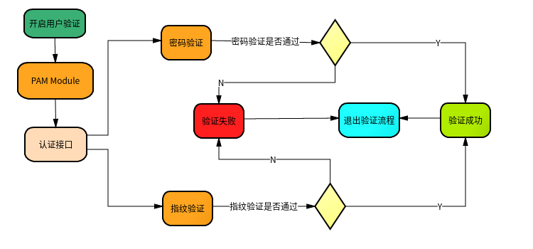
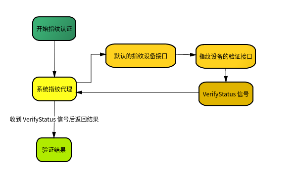

#+OPTIONS: toc:nil num:nil timestamp:nil ^:{} <:{}
#+TITLE: 指纹功能适配文档

本文档主要介绍第三方设备厂商如何将指纹功能集成到系统中，另外也简单描述了系统上的用户认证流程。
指纹功能的集成需要实现系统定义的指纹接口规范，然后将实现的接口程序安装到系统中，并提供规范中定义的配置文件，就可在重启后使用系统的指纹功能了。
在介绍适配步骤之前，先介绍下系统的认证流程。

** 认证流程

系统上对用户认证提供了一套统一的接口，这个认证接口负责启用具体的认证方式，如启用密码认证、指纹认证等。
认证的结果通过 =DBus Signal= 发出， =DBus Signal= 没有具体的目标，可以认为是广播的方式，即所有监听了这个 =Signal= 的程序都会收到。
指纹录入后由设置自行储存，推荐放在 /usr/share/deepin-authentication/modes/=设备标志=/userid/。

流程图如下：

#+ATTR_HTML: :width 100% :align right

--------

流程说明如下：

+ 开启用户验证

  这是指用户或者应用发起验证请求，如执行 =sudo ls= 就会发起验证请求

+ =PAM Module=

  系统中实现的认证接口的 =pam= 模块，验证请求调用这个模块来做具体的验证功能。在这个 =pam= 模块中会调用系统的认证接口，并等待认证信号。模块根据认证信号中的信息来判断认证是否成功。

+ 认证接口

  系统的认证接口会发起具体的认证方式，默认会发起 *密码认证* 和 *指纹认证* ，认证方式都是并行执行的。
  每种认证方式都会将认证的结果告知系统的认证接口，系统接口收到认证成功或认证失败的回应后会立即终止认证流程，并将结果返回。

  所以认证方式中只要又一种方式成功或者失败都会终止认证流程。

*** 指纹认证流程

适配的指纹接口主要在指纹认证流程内被调用，系统的认证接口中包含一个指纹认证代理(=FingerprintProxy=)，由 =FingerprintProxy= 调用适配的指纹接口。

=FingerprintProxy= 设计时考虑了多指纹设备的情况，当存在多个指纹设备接口时，需要先设置用哪个作为默认设备(初始时使用发现的第一个设备作为默认设备)。
=FingerprintProxy= 的接口是以 =DBus= 的方式提供的，是在 =System Bus= 中，默认设备相关的接口信息如下：

+ *Service:*

  =com.lingmo.daemon.Authenticate=

+ *Path:*

  =/com/lingmo/daemon/Authenticate/Fingerprint=

+ *Interface:*

  =com.lingmo.daemon.Authenticate.Fingerprint=

+ =SetDefaultDevice(char *device)=

  - =Description=

    设置默认的指纹设备，若失败则返回 =dbus error= 。

  - =Arguments=

    + =device=

      *(输入参数)*

      设备名称

+ =char *DefaultDevice=

  这是一个只读属性，知名当前的默认指纹设备

  默认的指纹设备，如果没有手动设置，则为发现的第一个指纹设备

  默认设备可以从控制中心中更改，用户可自由选择。

--------

了解了上面的信息后，下面开始介绍指纹认证的流程。

流程图如下：

#+ATTR_HTML: :alt Fingerprint Authentication Flow :width 100% :align right

流程说明如下：

+ 开启指纹认证

  由系统认证接口开启

+ 系统指纹代理

  此代理接口对接厂商适配的指纹接口，调用默认设备的接口完成请求的操作。适配的指纹接口通过配置文件告诉 =FingerprintProxy= 适配接口的相关 =DBus= 服务信息。

  此次流程中就会调用设备接口中 =DBus= 上提供的 =Verify= 方法进行指纹验证，然后等待 =VerifyStatus= 的信号来返回验证的结果。

--------
--------

** 指纹功能适配

指纹功能适配主要包括 *配置文件* 和 *接口实现* 两部分，适配步骤如下：

1. 确定指纹接口的 =DBus= 服务名称

   =DBus= 服务的名称包括以下内容：

   + =Service=

     指纹接口的 =DBus Service Name= ，在 =DBus Bus= 中应是唯一的。

   + =ObjectPath=

     指纹接口的 =DBus Object= ，指明服务所在的 =path=

   + =Interface=

     指纹接口的 =DBus Interface= ，指明服务所在的 =interface= ， =interface= 中应包括指纹接口规范中的所有接口。

2. 提供接口配置文件

  配置文件里需要描述接口的 =DBus= 信息，配置文件应安装到 =/usr/share/deepin-authentication/interfaces/= 目录中。
  系统的认证接口在启动时会扫面 =/usr/share/deepin-authentication/interfaces/= 目录，加载并检查配置文件中定义的接口。

  配置文件的格式如下：

  #+BEGIN_SRC json
  {
    "service": "",
    "path": "",
    "interface": "",
    "type": 1,
  }
  #+END_SRC

  各字段含义如下：

  + =service=

    =DBus= 接口的 =service name=

  + =path=

    =DBus= 接口的 =object path name=

  + =interface=

    =DBus= 接口的 =interface name=

  + =type=

    接口类型， =1= 表示指纹接口

3. 实现接口规范中的接口

   指纹接口规范中定义了适配时应该实现的接口，通过这些接口将指纹功能集成到系统中。 *指纹接口规范后文中将会介绍。*

4. 提供 =DBus= 服务的配置文件

   指纹功能需要访问硬件，所以一般是一个在 =System Bus= 上的服务。 =System Bus= 服务需要提供 =.service= 和 =.conf= 文件，说明如下：

   - =.service= 文件

     =.service= 文件中会指明调用 =service name= 时应该执行的程序，格式如下：

     #+BEGIN_SRC ini
     [D-BUS Service]
     Name=<service name>
     Exec=<app filepath>
     User=root
     #+END_SRC

     字段描述如下：

     + =Name=

       =DBus Service Name=

     + =Exec=

       程序的执行路径

     + =User=

       表明程序使用什么用户启动，默认为 =root=

    =.service= 应该安装到 =/usr/share/dbus-1/system-services/= 目录中

  - =.conf= 文件

    =.conf= 文件中会名接口的访问权限，内容如下(以 =com.lingmo.Example= 为 =service name= 和 =interface name= )：

    #+BEGIN_SRC xml
    <?xml version="1.0" encoding="UTF-8"?> <!-- -*- XML -*- -->

    <!DOCTYPE busconfig PUBLIC
     "-//freedesktop//DTD D-BUS Bus Configuration 1.0//EN"
     "http://www.freedesktop.org/standards/dbus/1.0/busconfig.dtd">
    <busconfig>
      <!-- Deny anyone to invoke methods on this service -->
      <policy context="default">
        <deny send_destination="com.lingmo.Example" />
      </policy>

      <!-- Only root can own the service and send message to this service -->
      <policy user="root">
        <allow own="com.lingmo.Example"/>
        <allow send_destination="com.lingmo.Example" />
      </policy>
    </busconfig>
    #+END_SRC

    =.conf= 文件安装到 =/usr/share/dbus-1/system.d/= 目录中

5. 测试

   将指纹接口配置文件、指纹接口程序、 =.service= 和 =.conf= 文件安装到对应的目录中，然后重启进行测试。

   测试步骤如下：

   1. 查看控制中心的账户模块中是否有添加指纹的选项

      若没有则表明指纹接口集成失败，请确认各个配置文件是否正确和指纹接口规范有没有完全实现。

   2. 点击添加指纹按钮

      添加一个指纹来测试指纹录入的功能是否正常

   3. 锁屏验证指纹登录

      用于验证指纹解锁是否正常

   4. 删除添加的指纹

      测试指纹模板的管理功能是否正常

--------
--------

** 指纹接口规范

下面将按照 =Methods, Properties, Signals= 一一介绍：

**** Methods

+ =Claim(char *id, bool claimed)=

  - =Description=

    独占指纹设备，失败则返回 =dbus error= 。指纹设备同时只允许做一种操作，不支持并行，所以需要在使用设备之前独占设备，如果成功就意味着设备可用，才能继续下面的操作。

  - =Arguments=

    + =id=

      *(输入参数)*

      用户的唯一 =id= ，由系统生成

    + =claimed=

      *(输入参数)*

      表示是否独占设备， =true= 表示独占， =false= 表示释放

--------

+ =Enroll(char *id, char *finger)=

  - =Description=

    指纹采集接口，调用成功后进入采集流程，失败则返回 =dbus error= 。采集过程中通过信号 =EnrollStatus= 返回每次采集的状态。只能在独占设备之后调用它。

  - =Arguments=

    + =id=

      *(输入参数)*

      此次采集的手指所属用户的唯一 =id=，由系统生成

    + =finger=

      *(输入参数)*

      此次采集的手指名

--------

+ =StopEnroll()=

  - =Description=

    结束当前采集流程，失败则返回 =dbus error=, 正常结束或中途取消都需要调用此方法。只能在独占设备后调用它。

--------

+ =Verify(char *finger)=

  - =Description=

    指纹验证接口，调用成功后进入验证流程，失败则返回 =dbus error= 。验证过程中通过信号 =VerifyStatus= 返回验证的结果。只能在独占设备后调用它。

  - =Arguments=

    + =finger=

      *(输入参数)*

      此次采集的手指名，可为空

--------

+ =StopVerify()=

  - =Description=

    结束当前的验证流程，失败则返回 =dbus error= ，正常结束或中途取消都需要调用此方法。只能在独占设备后调用它。

--------

+ =DeleteFinger(char *id, char *finger)=

  - =Description=

    删除指定 =finger= 的模板数据，删除失败则返回 =dbus error=

    =id= 和 =finger= 一起确定指纹模板的存储位置

  - =Arguments=

    + =id=

      *(输入参数)*

      用户的唯一 =id= ，由系统生成

    + =finger=

      *(输入参数)*

      需要删除的手指名

--------

+ =DeleteAllFingers(char *id)=

  - =Description=

    删除所以的模板数据，删除失败则返回 =dbus error=

  - =Arguments=

    + =id=

      *(输入参数)*

      用户的唯一 =id= ，由系统生成

--------

+ =ListFingers(char *id) （char **fingers)=

  - =Description=

    列出已录入的所有手指名，失败则返回 =dbus error=

  - =Arguments=

    + =id=

      *(输入参数)*

      用户的唯一 =id= ，由系统生成

    + =fingers=

      *(输出参数)*

      已录入的所有手指名

--------

+ =RenameFinger(char *id, char *finger, char *newName)=

  - =Description=

    重命名指定 =finger= 为 =newName=，失败则返回 =dbus error=

  - =Arguments=

    + =id=

      *(输入参数)*

      用户的唯一 =id= ，由系统生成

    + =finger=

      *(输入参数)*

      需要重命名的手指名

    + =newName=

      *(输入参数)*

      新名称

**** Properties

- =char *Name=

  *(只读)*

  设备名称

- =int32 State=

  *(只读)*

  设备状态, 可为以下位的组合：

  #+BEGIN_SRC c
  enum {
      DeviceStateNormal = 1 << 0,            // 设备正常可用
      DeviceStateClaimed = 1 << 1,           // 设备被独占
  };
  #+END_SRC

  最低位表示设备是否正常可用，没设置表示设备不可用，设置了表示设备正常可用；更高 =1= 位表示设备是否被独占了，没设置表示没被独占，即是空闲中，设置了表示被独占。

- =int32 Type=

  *(只读)*

  设备类型，可为以下值：

  #+BEGIN_SRC c
  enum {
      DeviceTypeUnknown = 0,    // 未知类型
      DeviceTypeScanning,       // 扫描式指纹设备
      DeviceTypeTouch,          // 触摸式指纹设备
  };
  #+END_SRC

- =int32 Capability=

  *(只读)*

  设备特性，可为以下值：

  #+BEGIN_SRC c
  enum {

      DeviceCapAutologin = 1,    // 支持指纹一键自动登录
  };
  #+END_SRC

**** Signals

- =EnrollStatus(char *id, int32 code, char *msg)=

  + =Description=

    采集流程中的信号，反馈采集的状态，包括采集进度、采集中的错误等信息

  + =Arguments=

    - =id=

      用户的唯一 =id= ，由系统生成

    - =code=

      状态码

    - =msg=

      详细的状态描述，录入成功后此字段应是录入的进度

  *状态码的详细说明如下:*

    - =code 0=

      =Completed= 成功完成，之后应该结束录入

      =msg= 为空

    - =code 1=

      =Failed= 失败，之后应该结束录入。

      =msg= 为空或 =JSON= 字符串，如果为 =JSON= ，则有 =subcode= 字段表示子代码:

        + =subcode 1=

         =unknown-error= 未知错误

        + =subcode 2=

          重复模板

        + =subcode 3=

          录入中断

        + =subcode 4=

           =data-full= 数据满了，不能再录制更多指纹

    - =code 2=

      =StagePassed= 阶段通过, 之后继续录入

      =msg= 为空或 =JSON= 字符串，如果是 =JSON= ，则有 =progress= 字段表示数字进度，取值范围 =0~100= 的整数:

    - =code 3=

      =Retry= 重试，之后继续录入

      =msg= 为空或 =JSON= 字符串，如果是 =JSON= ，则有 =subcode= 字段表示子代码:

        + =subcode 1=

          接触时间过短

        + =subcode 2=

          图形不可用

        + =subcode 3=

          两次触摸的指纹信息重复率过高

        + =subcode 4=

          当前指纹已经存在，请换其他的手指

        + =subcode 5=

          =swipe-too-short= 滑动太短

        + =subcode 6=

          =finger-not-centered= 手指不在中间

        + =subcode 7=

          =remove-and-retry= 拿开手指再重新扫描

    - =code 4=

      =Disconnected= 与设备失联，之后应该不对设备进行任何操作

      =msg= 为空

--------

- =VerifyStatus(char *id, int32 code, char *msg)=

  + =Description=

    验证流程中的信号，反馈验证的状态

  + =Arguments=

    - =id=

      用户的唯一 =id= ，由系统生成

    - =code=

      状态码

    - =msg=

      详细的状态描述

  *状态码的详细说明如下:*

    - =code 0=

      =Match= 匹配, 之后结束认证

      =msg= 为空

    - =code 1=

      =NoMatch= 不匹配，之后结束认证

      =msg= 为空

    - =code 2=

      =Error= 失败，之后结束认证

      =msg= 为空或 =JSON= 字符串，如果是 =JSON= ，则有 =subcode= 字段表示子代码:

        + =subcode 1=

          =unknown-error= 未知错误

        + =subcode 2=

          =unavailable= 指纹设备不可用

    - =code 3=

       =Retry= 重试，之后继续认证

       =msg= 为空或 =JSON= 字符串，如果是 =JSON= ，则有 =subcode= 字段表示子代码:

       + =subcode 1=

         =swipe-too-short= 滑动太短

       + =subcode 2=

         =finger-not-centered= 手指不在中间

       + =subcode 3=

         =remove-and-retry= 拿开手指再重新扫描

       + =subcode 4=

         =touch-too-short= 手指按压时间过短

       + =subcode 5=

         =quality-bad= 图像质量差

    - =code 4=

        =Disconnected= 与设备失联，之后不要对设备进行任何操作

        =msg= 为空

--------

- =Touch(char *id, bool pressed)=

  *(可暂不实现)*

  + =Description=

    手指是否接触指纹设备，接触和离开时都需要发送信号

  + =Arguments=

    - =id=

      用户的唯一 =id= ，由系统生成

    - =pressed=

      手指是否接触指纹设备
