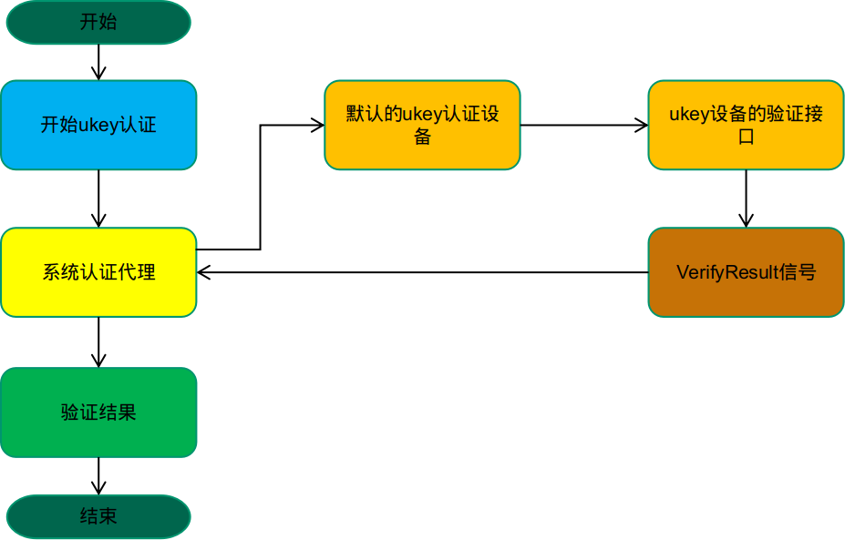

# `ukey` 功能适配文档
  本文档主要介绍第三方设备厂商如何将 `ukey` 功能集成到系统中，另外也简单描述了系统上的用户认证流程。`ukey` 功能的集成需要实现系统定义的 `ukey` 接口规范，然后将实现的接口程序安装到系统中，并提供规范中定义的配置文件，就可在重启后使用系统的 `ukey` 功能了。

---

## 认证流程
  系统上对用户认证提供了一套统一的接口，这个认证接口负责启用具体的认证方式，如启用密码认证、指纹认证等。认证的结果通过 `DBus Signal` 发出，`DBus Signal` 没有具体的目标，可以认为是广播的方式，即所有监听了这个 `Signal` 的程序都会收到。在介绍适配步骤之前，先介绍下 `ukey` 的认证流程。



---

## `ukey`功能适配
`ukey` 功能适配主要包括`配置文件`和`ukey 接口规范`两部分

---

### 配置文件

---

#### 配置文件适配步骤如下：
1. 确定 `ukey` 接口的 `DBus` 服务名称

   `DBus` 服务的名称包括以下内容：

   - `Service`
        `ukey` 接口的 `DBus Service Name` ，在 `DBus Bus` 中应是唯一的。

   - `ObjectPath`
        `ukey` 接口的 `DBus Object` ，指明服务所在的 `path`

   - `Interface`
        `ukey` 接口的 `DBus Interface` ，指明服务所在的 `interface` ， `interface` 中应包括 `ukey` 接口规范中的所有接口。

2. 提供接口配置文件
    配置文件里需要描述接口的 `DBus` 信息，配置文件应安装到 `/usr/share/deepin-authentication/interfaces/` 目录中。系统的认证接口在启动时会扫描 `/usr/share/deepin-authentication/interfaces/` 目录，加载并检查配置文件中定义的接口。

    配置文件的格式如下：
    ```json
    {
      "service": "",
      "path": "",
      "interface": "",
      "type": 2,
    }
    ```

    各字段含义如下：
   - `Service`
       `DBus` 接口的 `service`

   - `path`
       `DBus` 接口的 `object path`

   - `interface`
       `DBus` 接口的 `interface`

   - `type`
       接口类型， `2` 表示 `ukey` 接口


3. 实现接口规范中的接口
    `ukey` 接口规范中定义了适配时应该实现的接口，通过这些接口将 `ukey` 功能集成到系统中。**ukey 接口规范后文中将会介绍**。


4. 提供`DBus`服务的配置文件
    `ukey` 功能需要访问硬件，所以一般是一个在 `System Bus` 上的服务。 `System Bus` 服务需要提供 `.service` 和 `.conf` 文件，说明如下：

   - `.service` 文件
       `.service` 文件中会指明调用 `service name` 时应该执行的程序，格式如下：

     ```ini
     [D-BUS Service]
     Name=<service name>
     Exec=<app filepath>
     User=root
     ```

     字段描述如下：
     - `Name`

       `DBus Service Name`

     - `Exec`
       程序的执行路径

     - `User`
       表明程序使用什么用户启动，一般为 `root`

      **`.service` 应该安装到 `/usr/share/dbus-1/system-services/` 目录中**

   - `.conf`文件
     `.conf` 文件中会规定接口的访问权限，内容如下(以 `com.deepin.Example` 为 `service name` 和   `interface name` 为例)：

      ```xml
      <?xml version="1.0" encoding="UTF-8"?> <!-- -*- XML -*- -->

      <!DOCTYPE busconfig PUBLIC
      "-//freedesktop//DTD D-BUS Bus Configuration 1.0//EN"
      "http://www.freedesktop.org/standards/dbus/1.0/busconfig.dtd">
      <busconfig>

        <!-- Only root can own the service -->
        <policy user="root">
          <allow own="com.deepin.Example"/>
        </policy>

        <!-- Allow anyone to invoke methods on the interfaces -->
        <policy context="default">
          <allow send_destination="com.deepin.Example" />

          <allow send_destination="com.deepin.Example"
                send_interface="com.deepin.Example"/>
          <allow send_destination="com.deepin.Example"
                send_interface="org.freedesktop.DBus.Properties"/>
          <allow send_destination="com.deepin.Example"
                send_interface="org.freedesktop.DBus.Introspectable"/>
        </policy>

      </busconfig>
      ```

      **`.conf` 文件安装到 `/usr/share/dbus-1/system.d/` 目录中**

---
### `ukey`接口规范
  下面将按照 `Methods` , `Properties` , `Signals` 一一介绍：

---
#### Methods
---
##### Verify(char* uuid,char* gid)
  为指定 uuid 的用户开启 gid 次认证。如果设备没有与该用户绑定，则返回 dbus 错误信息，如果支持对该用户的认证，则继续进行认证操作。

- 参数：
    uuid：用户的 uuid

    gid: 此次认证的 id

---
##### SetPin(char* uuid,char* gid,char* pin)
  设置指定 uuid 的用户的 gid 次认证的 pin 码，设置完成后，驱动服务需要根据 pin 码是否正确发送认证结果信号。

- 参数:
    uuid:用户的 uuid

    gid: 此次认证的 id

    pin：pin 码

---
##### StopVerify(char* uuid,char* gid)
  结束 uuid 用户的 gid 次认证，失败则返回 dbus 错误信息，正常结束或中途取消都需要调用此方法。

- 参数:
    uuid:用户的 uuid

    gid: 此次认证的 id

---
##### SetSessionPath(char* uuid,char* gid,char* path)
  设置用户当前 session 的 DBus 路径，可以使用该 DBus 路径对 uuid 用户进行登出操作。此接口的调用根据配置文件。*该接口可能不调用*， path 可以被设置成空字符串。

- 参数：
    uuid：用户的 uuid

    gid: 此次认证的 id

    path：当前 session 的 DBus 路径

---
#### Properties
---
##### char *Name
（只读）

  设备名称

---

##### int32 State
  （只读）

  设备状态，可以为以下位的组合：

```c
enum {
    DeviceStateNormal = 1<<0,   //设备正常可用
    DeviceStateVerifing = 1<<1, //设备正在验证中
}
```
  最低位表示设备是否正常可用，没设置表示设备不可用或有异常，设置了表示设备正常可用；更高 1 位表示设备是否被正在验证中，没设置表示没有被使用，即是空闲中，设置了表示正在验证中。

---

##### int32 Type
  （只读）

  设备类型，可以为以下值：

```c
enum {
    DeviceTypeNormal = 0,   //设备插入并验证成功即可操作机器
    DeviceTypeDongle ,      //设备需要一直插入才可操作机器
}
```
  DeviceTypeNormal 表示设备为正常 ukey 设备，插入并验证成功之后即可获得操作机器权限， ukey 可以拔出。
  DeviceTypeDongle 表示设备为加密狗类型 ukey 设备，插入并验证成功之后即可获得操作机器权限，且 ukey 不能拔出，拔出之后可触发锁屏。（该操作由驱动服务调用）。

---

##### int32 Capability
  （只读）

  设备是否支持同时开启多次认证，可以为以下值：

```c
enum {
    DeviceCapabilitySingle = 0,   //只能同时开启一次认证
    DeviceCapabilityMulti,        //可以支持同时开启多次认证
}
```
  DeviceCapabilitySingle 表示 UKey 只能同时开启一次认证，在上一次认证没有结束时开启下一次认证，会终止上一次认证。
  DeviceCapabilityMulti 表示 UKey 可以支持同时开启多次认证，在上一次认证没有结束时开启下一次认证，两次认证可以同时进行。

---
#### Signals
---
##### VerifyResult(char* id,char* msg)
  验证结果。

- 参数

  id：用户的 uuid

  msg： json 格式的认证结果，若成功，则 `result` 字段为1, `description` 字段可为空，若失败，则 `result` 字段为0, `descriprion` 可给出对应的失败描述信息。 
  json 定义如下

  ```json
  {
      "result":1,
      "description":"",
      "id":""
  }
  ```
  各字段功能描述：

    result：int 类型，认证结果。 0 为失败， 1 为成功

    description： char* 类型，对认证结果的描述信息

    id: char* 类型，此次认证的 gid

---
