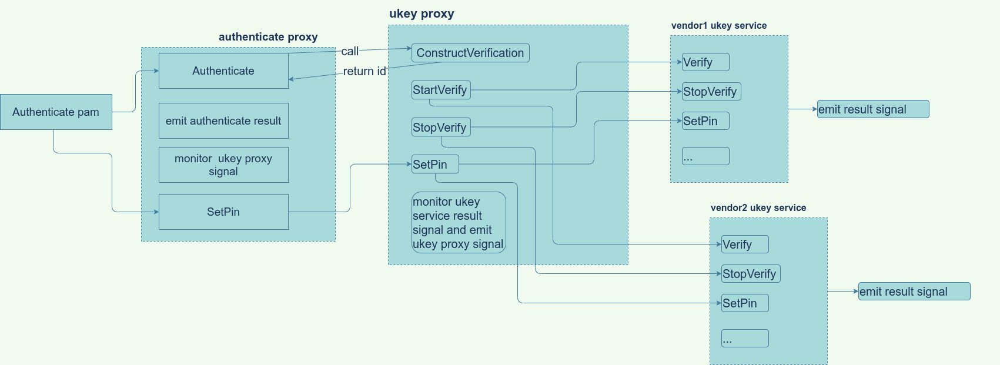

# ukey代理接口设计文档

## ukey代理的功能
作为代理，接受上层 com.lingmo.daemon.Authenticate 或者其他调用方的调用，开启指定的厂商 ukey 服务并认证，并接收厂商 ukey 认证信号，代理处理完此信号之后，发送认证信号出去，供监听此信号的服务使用。
ukey 需要支持多设备同时认证，不一定是一个 ukey 服务的多次同时认证，也可以是多个 ukey 服务的单次同时认证。

## ukey代理接口
1. `SetDefaultDevice(string device) -> ()`
   设置默认的ukey服务

2. `ConstructVerification(string serviceName,string username, bool useDefaultService) -> (string id)`
    设置认证相关信息，该接口返回一个唯一 id ，标识此次认证

   参数说明：
      serviceName: 为 ukey 服务的 serviceName
      username: 为需要认证的用户的名称
      useDefaultService: 是否使用默认的 ukey 服务， true 为是，当为 true 时， serviceName 可为空""
   返回值：
      id: 标识此次认证

3. `StartVerify(string id) -> ()`
   开始id次认证

4. `SetPin(string id,string pin) -> ()`
   给id次认证设置pin码

5. `StopVerify(string id)`
   关闭id次的认证

6. `SetSessionPath(string id)`
   给 id 次认证设置这个 session 的 path ，该路径为 `org.freedesktop.login1` 上的 session 路径，可以让 ukey 服务调用 `org.freedesktop.login1.Session.Lock` 来锁屏，是否调用此接口根据` ukey 接口文档`中的 `Type` 属性来决定。

## ukey代理逻辑

ukey 认证时，通过 `authenticate proxy` 的 `Authenticate` 调用 `ukey proxy` 的 `ConstructVerification` 方法，来设置每组认证相关的信息，在该接口中，会返回一个 **id** 给调用方，用来识别该次认证，随后 `authenticate proxy` 会将该 id 与自身的认证组 **id** 进行绑定，在随后 `authenticate proxy` 对 `ukey proxy` 的接口调用过程中，都会将认证组 id 与 `ukey proxy` 返回的 id 做一个转换。

设置完每组认证相关信息之后， `ukey proxy` 会负责控制ukey的认证过程，其中 `SetPin` 接口的调用由 `pam` 模块发起，随后通过 `authenticate proxy` -> `ukey proxy` -> `vendor ukey service` 的流程转发到厂商的ukey。

`ukey proxy` 接收ukey的认证结果信号，并将此信号转发给 `authenticate proxy` ， `authenticate proxy` 会将最终通过信号返回给pam模块，由pam模块给出最终的认证结果。

## ukey认证前提
1. 需要编写多因子配置文件，且配置了 ukey 服务
2. dbus 上需要有此 ukey 服务
